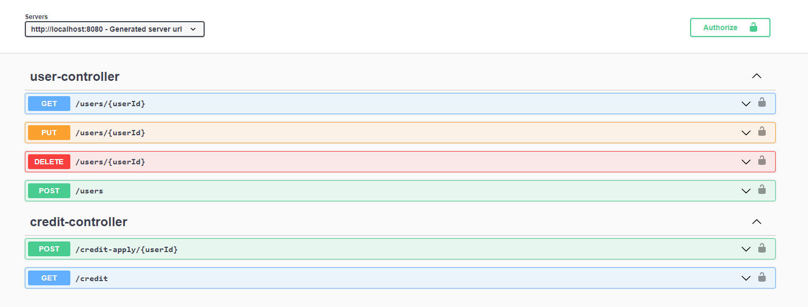
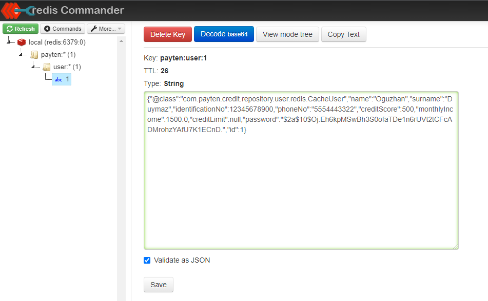
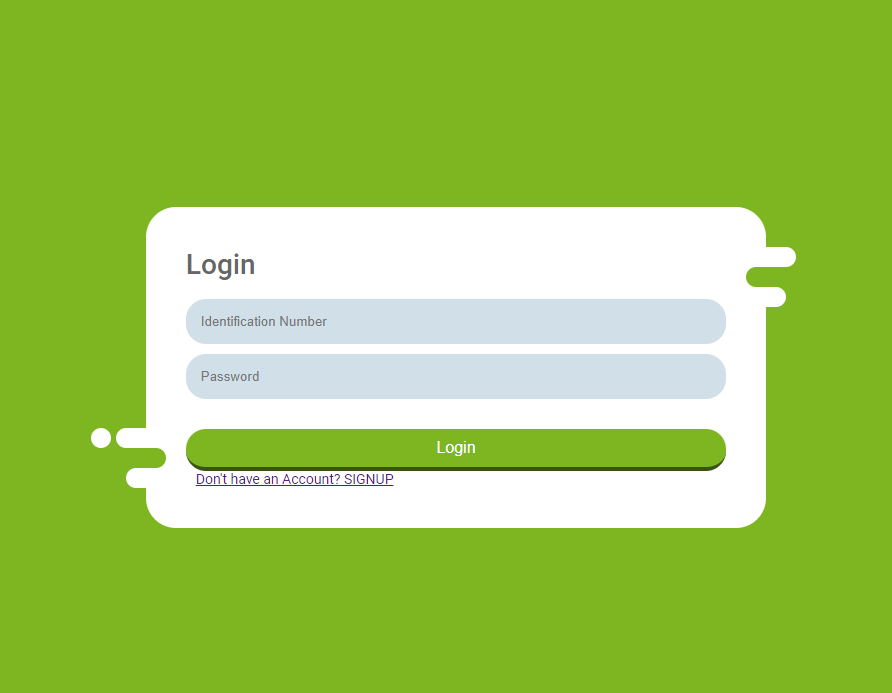
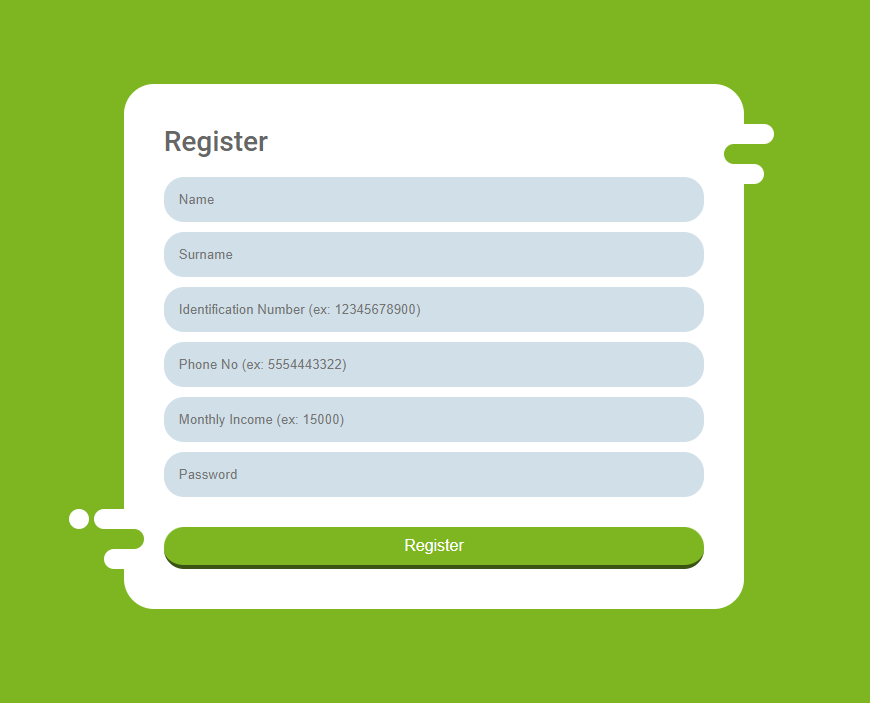
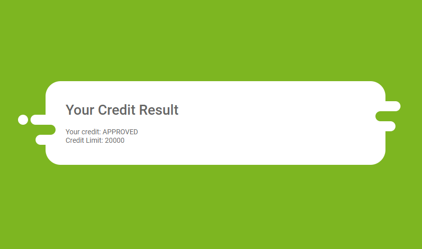
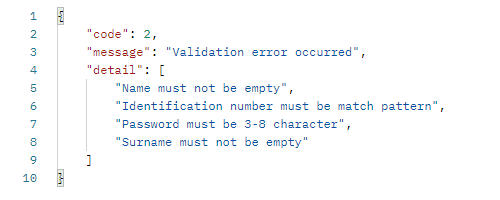
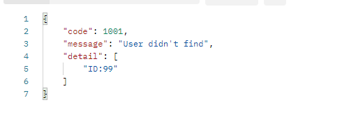
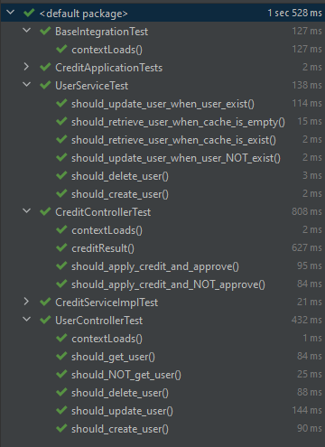

# Credit Application

Credit Application System, It takes credit application requests and gives response according to customer information.

## Running
Credit API is a Spring Boot via maven. You can build a jar and deploy with docker.
```bash
git clone https://github.com/0uz/CreditProject.git
mvn clean install -U -DskipTests=true
docker-compose build --no-cache
docker-compose up --force-recreate
```

---

## Technologies
:white_check_mark: Spring Boot <br>
:white_check_mark: Postgresql <br>
:white_check_mark: Redis <br>
:white_check_mark: Docker <br>
###Tools
:white_check_mark: Swagger Open API <br>
:white_check_mark: Redis Commander <br>

---
## Documentation
###Swagger
```html
http://localhost:8080/swagger-ui/index.html
```


###Redis Commander
```html
http://localhost:8081
```



---
##Frontend
```html
cd CreditProjectFrontend
.\landingPage.html
```
 <br>
 <br>
<br>
---
##Exception Handling
Exceptions handled<br>


---

## Tests
Integration and Unit tests written.<br>


## Contributing
Pull requests are welcome. For major changes, please open an issue first to discuss what you would like to change.

Please make sure to update tests as appropriate.
